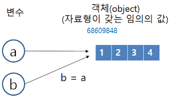

# 배열

배열이란 연관된 데이터를 하나의 변수에 그룹핑해서 관리하기 위한 방법이다. 따라서 하나의 변수에 여러 정보를 담을 수 있고, 반복문과 결합하면 많은 정보도 효율적으로 처리할 수 있다.


## 리스트 (mutable)

리스트는 뮤터블 리스트형 객체로 원소를 변경할 수 있다.

```
list01 = []
list02 = [1, 2, 3]
list03 = ['A', 'B', 'C', ]
list04 = list()
list05 = list('ABC')
list06 = list([1, 2, 3]) #[1, 2, 3] 리스트로부터 원소를 생성
list07 = list((1, 2, 3)) #(1, 2, 3) 튜플로부터 원소를 생성
list08 = list({1, 2, 3}) #{1, 2, 3} 집합으로부터 원소를 생성
list09 = list(range(7)) #[0, 1, 2, 3, 4, 5, 6]
list10 = list(range(3, 8)) #[3, 4, 5, 6, 7]
list11 = list(range(3, 13, 2)) #[3, 5, 7, 9, 11]
list12 = [None] * 5 #[None, None, None, None, None]
```

## 튜플 (immutable)

튜플은 원소에 순서를 매겨 결합한 것으로 원소를 변경할 수 없다.

```
tuple01 = ()
tuple02 = (1,)
tuple03 = 1, 2, 3 #이러면 튜플이 만들어진다. 리스트 X
tuple04 = tuple()
tuple05 = tuple(range(7))
```

### 리스트, 튜플의 동일성

따로따로 생성한 리스트에서 모든 원소의 값이 같아도 실체는 각각 다르다. 아래는 lst1과 lst2의 동일성(식별 번호)이 같은지 연산자 is로 판단하는데 False가 나타난 모습이다.
```
>>> lst1 = [1, 2, 3, 4, 5]
>>> lst2 = [1, 2, 3, 4, 5]
>>> lst1 is lst2
False
```
이는 lst1과 lst2 모두 같은 리스트를 생성한 것처럼 보이지만 이는 리터럴(고정된 값)이 아니기 때문이다. 리스트를 2개 선언하여 서로 대입해도 원소 자체는 복사되지 않는다. 대입에서 복사되는 것은 값이 아니라 참조하는 곳이기 때문이다.



```
>>> a = [1, 2, 3, 4]
>>> b = a
>>> a is b
True
>>> a[2] = 9
>>> a
[1, 2, 9, 4]
>>> b
[1, 2, 9, 4]
```
대입식 b = a에서 b는 a(참조하는 곳의 리스트)를 참조한다. 그림처럼 b와 a는 같은 실체(리스트)를 참조하는 것이다. 따라서 a에서 인덱스식(또는 슬라이스식)으로 원솟값을 바꾸면 b의 원솟값도 바뀐다. 튜플또한 튜플 자체를 대입할 수 있지만 원소에는 대입할 수 없다.

### 언팩

파이썬에서는 좌변에 여러 개의 변수를 놓고 우변에는 리스트나 튜플을 놓아 그 안의 원소들을 풀어 좌변의 변수들에 대입할 수 있다. 이를 <b>언팩(unpack)</b>이라고 한다.

```
>>> x = [1, 2, 3]
>>> a, b, c = x
>>> a, b, c
(1, 2, 3)
```

### 리스트 스캔

1. 원소 수를 len() 함수로 미리 알아내서 사용한다.
```
for i in range(len(x)):
    print(f'x[{x}] = {x[i]}')
```

2. 인덱스와 원소를 짝지어 enumerate() 함수로 반복해서 꺼낸다.
```
x = ['John', 'George', 'Paul']

for i, name in enumerate(x):
    print(f'x[{i}] = {name}')
```
> enumerate() 함수는 인덱스와 원소를 짝지어 튜플로 꺼내는 내장 함수이다. 위와 같은 경우 처음부터 순서대로 (0, 'John'), (1, 'George')... 으로 꺼낸다. 

3. 2와 같지만 1부터 카운트한다.
```
for i, name in enumerate(x, 1):
    print(f'{i}번째 = {name}')
```

4. 인덱스 값을 사용하지 않고 in을 사용해서 처음부터 순서대로 꺼낸다.

```
for i in x:
    print(i)
```
> 위 코드가 실행되는 이유는 이터러블 객체, 곧 순차 반복 객체이기 때문이다.

## 이터레이터

파이썬에서 이터레이터(반복자)는 여러개의 요소를 가지는 컨테이너(리스트, 튜플, 집합, 딕셔너리, 문자열)에서 각 요소를 하나씩 꺼내 어떠한 처리를 수행하는 간편한 방법을 제공하는 객체이다.
```
for key, value in {"a":1, "b":2, "c":3}.items():
    print(key, value)
```
```
>>> s = 'abc'
>>> it = iter(s)
>>> it
    <str_iterator object at 0x000001B6297FB760>
>>> next(it)
    'a'
>>> next(it)
    'b'
>>> next(it)
    Traceback (most recent call last):
        File "<pyshell#6>", line 1, in
            next(it)
    StopIteration
```
for 문은 먼저 주어진 컨테이너 객체에 대해 iter() 내장 함수를 호출해서 이터레이터 객체를 구한다. 그리고 내부의 요소를 하나씩 가져오기 위해서 __next__함수를 호출한다. 이 함수는 하나의 요소를 반환하고 다음 요소를 가리킨다. 더이상 가져올 것이 없으면 StopIteration 예외를 발생시킨다. 이터레이터에 대해 다음 요소를 직접 가져오기 위해서는 내장 함수인 next()를 사용할 수 있다.

## 리스트의 복사

리스트를 복사할 때 사용하는 copy() 함수는 주의해서 사용해야 한다. 리스트를 복사한 후 원솟값을 변경하면 복사된 원솟값까지 변경될 수 있기 때문이다.

* 얕은 복사
```
>>> x = [[1, 2, 3], [4, 5, 6]]
>>> y = x.copy()
>>> x[0][1] = 9
>>> x
[[1, 9, 3], [4, 5, 6]]
>>> y
[[1, 9, 3], [4, 5, 6]]
```
copy를 활용한 얕은 복사(shallow copy)는 리스트 안의 모든 원소가 참조하는 곳까지 복사가 된다. 위 코드에서 복사되는 모든 원소는 x[0], x[1]이다. x[0]과 y[0]이 참조하는 곳이 같으므로 x[0][1]과 y[0][1]이 참조하는 곳도 같다. 즉, 리스트 x가 참조하는 곳이 다르면 y도 달라진다. 이런 상황을 피하기 위해 **깊은 복사(deep copy)**를 사용한다.

* 깊은 복사

```
>>> import copy
>>> x = [[1, 2, 3], [4, 5, 6]]
>>> y = copy.deepcopy(x)
>>> x[0][1] = 9
>>> x
[[1, 9, 3], [4, 5, 6]]
>>> y
[[1, 2, 3], [4, 5, 6]]
```
깊은 복사를 사용하면 리스트의 원소뿐만 아니라 원소의 원소도 복사된다. 이처럼 깊은 복사는 참조값 뿐만 아니라 참조하는 객체 자체를 복사한다. 즉, 객체가 갖는 모든 멤버(값과 참조 형식 모두)를 복사하므로 **전체복사**라고도 한다.

<hr>

## 매개변수와 실제 인수의 관계

파이썬에서는 매개변수에 실제 인수가 <b>대입</b>된다. 
```
def sum_1ton(n):
    s = 0
    while n > 0:
        s += n
        n -= 1
    return s

x = int(input())
print(f'{sum_1ton(x)}')
```
위 코드에서 input으로 5가 들어갔을 때, 함수의 시작 시점에는 x와 n이 5라는 객체를 참조한다. 그리고 함수 내의 반복문이 돌면서 n은 점점 작아져 0이라는 객체를 참조하게 된다. 이 때 x는 똑같이 5를 참조한다.

<em>다른 프로그래밍 언어에서는 실제 인수의 값을 매개변수에 복사하는 <b>값에 의한 호출(call by value)</b>을 사용하거나, 실제 인수의 참조를 매개변수에 복사하여 매개변수가 실제 인수와 같아지는 <b>참조에 의한 호출(call by object reference)</b>을 사용한다.</em>

함수의 실행 시작 시점에서 매개변수는 실제 인수와 같은 객체를 참조한다. 함수에서 매개변수의 값을 변경하면 인수의 형에 따라 다음과 같이 구분한다.

1. 인수가 이뮤터블일 때 <br> 함수 안에서 매개변수의 값을 변경하면 **다른 객체를 생성**하고 그 객체에 대한 참조로 업데이트된다. 따라서 매개변수의 값을 변경해도 호출하는 쪽의 실제 인수에는 영향을 주지 않는다.

2. 인수가 뮤터블일 때 <br> 함수 안에서 매개변수의 값을 변경하면 객체 자체를 업데이트한다. 따라서 매개변수의 값을 변경하면 호출하는 쪽의 실제 인수는 값이 변경된다.
<hr>

## 자료형 힌트

아래는 파이썬 실습 간 사용한 코드 중 하나이다.
```
from typing import Any, Sequence
```
Any는 제약이 없는 임의의 자료형을 의미하고, Sequence는 시퀀스형을 의미합니다. 또한 시퀀스형에는 <em>리스트형, 바이트 배열형, 문자열형, 튜플형, 바이트열형</em> 이 있다.
```
def max_of(a: Sequence) -> Any:
```
따라서 두 자료형을 사용하여 max_of() 함수를 다음과 같이 정의한다.

* 건네받는 매개변수 a의 자료형은 Sequence이다. 
* 반환하는 것은 임의의 자료형인 Any이다.

이를 바탕으로 max_of() 함수의 특성은 다음과 같이 정리할 수 있다.

* 함수 안에서는 배열 a의 원솟값을 변경하지 않는다.
* 호출하는 쪽이 넘겨주는 실제 인수의 자료형은 뮤터블인 리스트, 이뮤터블인 튜플, 문자열 등 시퀀스 자료형이라면 무엇이든 상관 없다.
* 인수의 원소를 비교 연산자 > 로 값을 비교할 수 있다면 배열에 다른 형 원소 (int형, float형)이 섞여 있어도 된다.
* 최댓값의 원소가 int형 원소라면 int형 값을 반환하고, float형 원소이면 float형 값을 반환한다.

# 모듈

파이썬에서는 하나의 스크립트 프로그램을 모듈이라고 한다. 확장자(.py)를 포함하지 않는 파일의 이름 자체를 모듈 이름으로 사용한다. 예를 들면, 파일 이름이 max.py일 경우 모듈 이름은 max이다.

```
if __name__ == '__main__':
```
이 if 문에서는 __name__과 __main__이 같은지를 판단한다. 왼쪽의 피연산자 __name__은 모듈 이름을 나타내는 변수이고 작성 규칙은 다음과 같다. 

* 스크립트 프로그램이 직접 실행될 때 변수 __name__은 __main__이다.
* 스크립트 프로그램이 import될 때 변수 __name__은 원래의 모듈 이름이다.

모든 것을 객체로 다루는 파이썬이기에 모듈도 당연히 객체이다. 모듈은 프로그램이 처음 임포트되는 시점에 그 모듈 객체가 생성되면서 초기화되는 구조이다. 따라서 어떤 모듈.py 파일이 직접 실행되었을 경우에만 (즉, __name__과 __main__이 일치하는 경우) 참이 되어 if 문 밑을 실행할 수 있다. 만약 다른 스크립트 프로그램에서 임포트한 경우에는 거짓이 되므로 if 문이 실행되지 않는다.

### 참고

<a href="https://m.blog.naver.com/PostView.naver?isHttpsRedirect=true&blogId=sisosw&logNo=221326583311" target="_blank">시소코드랩 - 파이썬 자료구조</a>

<a href="https://offbyone.tistory.com/83" target="-blank">쉬고 싶은 개발자 - 파이썬 문법 6 이터레이터</a>
